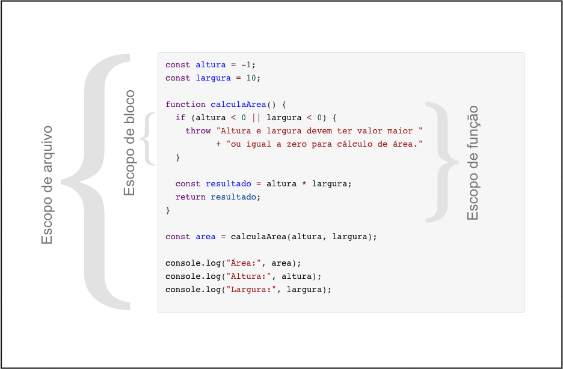

# Escopo


Escopo pode ser interpretado como uma "área". É uma forma de restringir onde informações estão visíveis e diferenciar conteúdos de mesmo nome, já que o mesmo nome em escopos diferentes, representa itens diferentes.


Se definimos o escopo como uma sala de aula, sabemos que os alunos a que estamos nos referindo são apenas daquela sala de aula em específico, agora se trabalhamos em um escopo mais abrangente como "escola", estamos falando dos alunos da escola mais os alunos da sala especificada anteriormente já que o escopo sala de aula está contido dentro do escopo escola. Deu pra entender a ideia geral? Espero que sim :-)

Bom, e como isso funciona quando estamos falando de código? Vou começar explicando sobre os escopos mais comuns existentes em desenvolvimento:

## Escopo Global

O escopo global é acessível de qualquer parte do seu código. É um escopo comumente usado para acesso à configurações ou recursos básicos da aplicação. É um escopo que deve ser usado com alguma cautela, já que alterações no escopo global podem causar efeitos colaterais em sua aplicação que são difíceis de detectar.

## Arquivo, Módulo, Classe

O escopo de arquivo, módulo ou classe limita o conhecimento da informação para dentro do arquivo/módulo/classe em que a informação está definida (esses nomes variam de acordo com a linguagem utilizada e podem ter pequenas variações de funcionamento, mas a minha intenção é esclarecer a ideia geral no tema).

Então uma variável definida dentro deste escopo é de livre acesso para tudo existente dentro deste arquivo/módulo/classe, e para ser acessado de forma externa, dependará de mecânicas de exposição das mesmas.

## Função ou Método

O escopo de função ou método  define que tudo o que é criado dentro daquela função só será acessível para o que estiver dentro da função. Códigos de outras funções ou dentro do contexto no qual a função está inserida, não conseguirão ter acesso aos dados daquela função, mesmo estando no mesmo arquivo.

## Escopo de bloco de código

É o escopo delimitado por blocos de decisão como *ifs* ou blocos de repetição como *for* .


## Certo, temos escopos, mas que diferença isso faz?

Bom, imagino que a informação passada até aqui ainda não escalrece muita coisa, mas vai começar a ficar mais claro agora:

```javascript
const altura = -1; 
const largura = 10;

function calculaArea() {
  if (altura < 0 || largura < 0) {
    throw "Altura e largura devem ter valor maior "
          + "ou igual a zero para cálculo de área." 
  }
      
  const resultado = altura * largura;
  return resultado;
}

const area = calculaArea(altura, largura);

console.log("Área:", area);
console.log("Altura:", altura);
console.log("Largura:", largura);

```


Nesse trecho de código conseguimos identificar os seguintes escopos:




Como o escopo de arquivo é mais abrangente, conseguimos acessar `altura` e `largura` dentro da função declarada neste mesmo arquivo, já que o escopo da função **calculaArea()** está contido neste arquivo. No entando quando queremos o `resultado` presente dentro da função **calculaArea()**, não é possível acessá-la diretamente, a não ser expondo a variável através do retorna da função.

